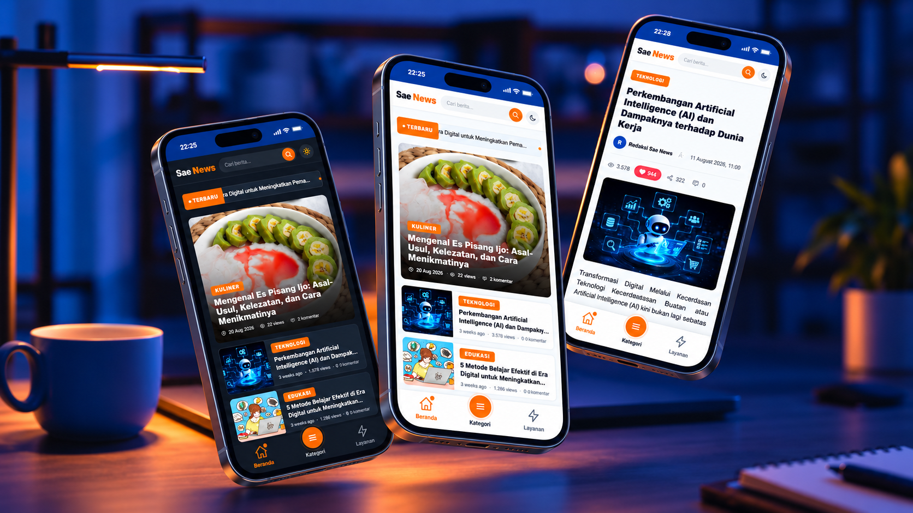
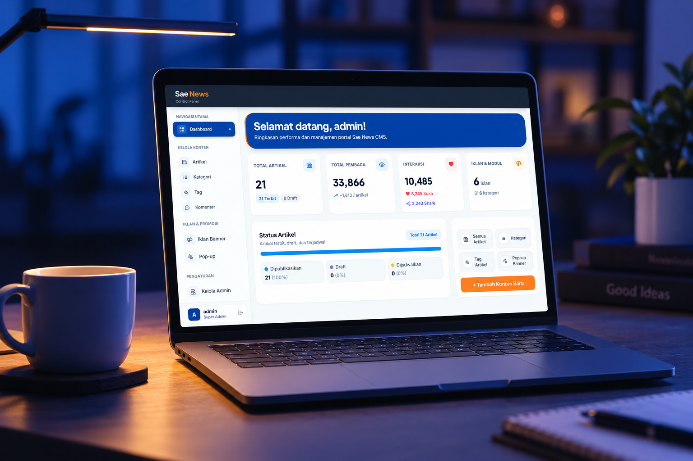

<div align="center">
  
  
  <br />
  <br />

  <h1>Sae News</h1>
  
  <p>
    <strong>Platform jurnalisme dan literasi digital modern dengan fokus pada performa tinggi, pengalaman membaca imersif, moderasi konten cerdas, algoritma audit SEO real-time, serta ekosistem monetisasi berkelanjutan.</strong>
  </p>

  <p>
    
    
    
    
    
    
    
  </p>

  <br />
  
</div>

---

## Ringkasan Eksekutif

**Sae News** adalah platform publikasi digital terpadu yang dirancang khusus untuk memenuhi standar media modern berkaliber industri. Dibangun di atas arsitektur **Laravel 12** dan antarmuka mutakhir **Tailwind CSS v4**, Sae News merevolusi cara institusi, redaksi, dan pembaca berinteraksi dengan konten edukatif dan warta berita.

Platform ini mengintegrasikan enam fondasi utama:
1. **Pengalaman Membaca Imersif (*Reader-First UI & PWA*)**: Tipografi ergonomis (Plus Jakarta Sans & Inter), layout adaptif bebas *layout shift*, navigasi mobile app-like, serta dukungan instalasi *Progressive Web App* (PWA).
2. **Infrastruktur Interaksi Anti-Abuse**: Validasi interaksi pembaca (*views*, *likes*, *shares*) yang akurat berbasis sesi unik dan *device fingerprinting* (kombinasi IP, User-Agent, dan hash SHA-256).
3. **Ekosistem Diskusi Bersih & Cerdas**: Sistem moderasi komentar terintegrasi dengan filter NLP anti-toksisitas, pemblokiran spam/judi online, serta fitur terjemahan otomatis.
4. **Mesin Penilaian SEO & Keterbacaan Real-Time**: Asisten analitik editorial instan pada artikel studio yang mengaudit panjang judul, kepadatan konten, keterbacaan paragraf, hierarki heading, dan tautan dengan skala penilaian 0–100 poin berbobot parsial.
5. **Mesin Monetisasi Kontekstual**: Pengelolaan kampanye iklan multi-slot (Header, In-Article, Sidebar, Sticky Footer) dan modal promosi interaktif (*smart popups*) dengan *frequency capping*.
6. **Pipeline Media & Kompresi Otomatis**: Konversi dan kompresi aset gambar otomatis ke format modern WebP generasi baru dengan pembatasan bobot ≤ 300 KB demi kecepatan akses kilat (*sub-second loading*).

---

## Filosofi & Pilar Arsitektur Platform

```
                             ┌──────────────────────────────────────┐
                             │       Sae News Digital Engine        │
                             └──────────────────┬───────────────────┘
                                                │
         ┌──────────────────┬───────────────────┼───────────────────┬──────────────────┬──────────────────┐
         │                  │                   │                   │                  │                  │
         ▼                  ▼                   ▼                   ▼                  ▼                  ▼
      Reader-First     Anti-Abuse         AI/NLP Safe         Real-Time SEO     Contextual        High-Speed
      & PWA Ready         Metrics             Discussions         Intelligence       Monetization        Pipeline
```

### 1. Reader-First Visual Hierarchy & PWA Capability
Memadukan estetika editorial kontemporer dengan performa rendering instan:
- Tipografi editorial premium memanfaatkan *Plus Jakarta Sans* untuk *heading* dan *Inter* untuk *body text*.
- Mengeliminasi *Cumulative Layout Shift* (CLS) dengan rasio aspek media terkunci.
- Dukungan *Progressive Web App* (PWA) dengan *Service Worker* dan *Web App Manifest*, memungkinkan pengalaman membaca layaknya aplikasi native pada perangkat mobile.
- *Mobile-first bottom navigation tabbar* untuk navigasi cepat satu tangan.

### 2. Akurasi Metrik & Proteksi Manipulasi Data
Data keterlibatan pembaca merupakan aset penting bagi redaksi. Sae News menerapkan mekanisme validasi ketat:
- **Unique Views**: Dihitung secara objektif dengan deduplikasi sesi per artikel untuk mencegah penggelembungan metrik (*view inflation*).
- **Anti-Spam Fingerprinted Likes**: Pelacakan kombinasi *Cookie UUID*, alamat IP, dan *browser signature hash* (SHA-256) untuk memastikan satu perangkat hanya memiliki satu hak suara per artikel.
- **Granular Share Tracking**: Pencatatan konversi distribusi konten lintas kanal (WhatsApp, Twitter/X, Facebook, LinkedIn, dan Salin Tautan) dengan mitigasi *rate limit*.

### 3. Diskusi Sehat Berbasis NLP (Natural Language Processing)
Interaksi publik dijaga melalui filter cerdas di tingkat backend:
- **Toxicity & Profanity Filter**: Deteksi variasi bahasa kasar, *leetspeak* (substitusi angka/huruf), dan pengulangan karakter dalam Bahasa Indonesia maupun Inggris.
- **Anti-Spam & Promosi Ilegal**: Pemblokiran otomatis terhadap indikasi promosi judi online, tautan mencurigakan, dan ujaran kebencian.
- **Multilingual Support**: Integrasi terjemahan komentar secara instan untuk memperluas jangkauan diskusi lintas bahasa.

### 4. Real-Time SEO & Content Readability Engine
Membimbing penulis dan editor untuk menghasilkan naskah yang ramah mesin pencari (Google SEO) dan nyaman dibaca manusia tanpa perlu alat eksternal berbayar:
- Evaluasi langsung (*on-the-fly*) saat mengetik menggunakan *DOMParser* terisolasi.
- Kalkulasi otomatis mencakup panjang judul, jumlah kata murni (bebas tag HTML), kepadatan kata per paragraf, struktur heading, dan tautan rujukan.
- Indikator kesehatan visual (*live scoring badge*) 0–100 poin dengan umpan balik checklist yang jelas.

### 5. Monetisasi Cerdas & Non-Intrusif
Menyeimbangkan keberlanjutan bisnis media dengan kenyamanan membaca melalui *ad-slot placement* yang terukur:
- **Contextual Ad Placements**: Banner iklan dapat ditargetkan secara global, spesifik per kategori, atau terikat langsung pada artikel tertentu.
- **Dynamic Popup Management**: Dialog promosi interaktif yang dilengkapi batas frekuensi penayangan (*session cooldown*) agar tidak mengganggu aktivitas berselancar pengunjung.

### 6. Otomatisasi Media & Bandwidth Efficiency
Setiap aset visual (thumbnail artikel, banner promosi, atau media redaksi) diproses secara otomatis oleh sistem:
- Konversi format otomatis ke **WebP** berkualitas tinggi.
- Normalisasi orientasi EXIF kamera secara otomatis.
- Kompresi cerdas dengan batas target maksimal **≤ 300 KB** guna menjamin waktu muat halaman yang kilat (*sub-second loading*).

---

## Standar & Algoritma Penilaian SEO (Real-Time Content Intelligence)

Sistem Editor Artikel Sae News (berbasis *Quill.js*) dilengkapi dengan **Kalkulator SEO & Keterbacaan Real-Time** yang menerapkan **Logika Bobot Parsial** (*Partial Weight Logic*). Artinya, meskipun suatu kriteria belum mencapai kondisi ideal sempurna, kontributor tetap memperoleh poin parsial atas upaya optimasi yang dilakukan.

Total skor maksimal yang dapat dicapai adalah **100 Poin**, terbagi ke dalam 5 kriteria utama:

| No | Parameter Metrik | Bobot Maksimal | Logika & Ambang Batas Penilaian |
| :-: | :--- | :-: | :--- |
| **1** | **Panjang Judul (*Title Length*)** | **20 Poin** | • **20 Poin (Sempurna):** 50 – 60 karakter (standar emas snippet Google).<br>• **10 Poin (Cukup):** 1 – 49 karakter, atau 61 – 80 karakter.<br>• **0 Poin (Buruk):** Kosong atau > 80 karakter (terpotong di SERP). |
| **2** | **Panjang Konten (*Word Count*)** | **30 Poin** | Dihitung otomatis via `DOMParser` (hanya teks murni, tag HTML diabaikan).<br>• **30 Poin (Sempurna):** ≥ 300 kata (standar minimal konten mendalam).<br>• **15 Poin (Cukup):** 150 – 299 kata.<br>• **0 Poin (Buruk):** < 150 kata (*thin content* rawan penalti mesin pencari). |
| **3** | **Tingkat Keterbacaan (*Readability*)** | **20 Poin** | Menganalisis kepadatan kata pada setiap blok paragraf (`<p>`).<br>• **20 Poin (Sempurna):** **0 paragraf** yang melebihi 150 kata per blok.<br>• **10 Poin (Peringatan):** Terdapat **tepat 1 paragraf** > 150 kata.<br>• **0 Poin (Buruk):** Terdapat **≥ 2 paragraf** > 150 kata (terlalu padat/melelahkan). |
| **4** | **Hierarki Subjudul (*Headings*)** | **15 Poin** | Memastikan artikel memiliki pemecahan topik yang terstruktur.<br>• **15 Poin (Sempurna):** Memiliki minimal **1 Subjudul** (tag `<h2>` atau `<h3>`).<br>• **0 Poin (Buruk):** Tidak ada subjudul sama sekali. |
| **5** | **Tautan Rujukan (*Links*)** | **15 Poin** | Membangun jaringan web interkonektif (*Internal Link* / *External Link*).<br>• **15 Poin (Sempurna):** Memiliki minimal **1 Tautan** (tag `<a>`).<br>• **0 Poin (Buruk):** Konten terisolasi tanpa rujukan tautan. |

### Klasifikasi Badge & Indikator Kesehatan Skor

Setiap perubahan teks akan langsung memperbarui kalkulasi secara debounced (300ms) dan menampilkan lencana status visual:

| Status Badge | Rentang Nilai | Status Kesiapan Publikasi | Rekomendasi Tindakan |
| :--- | :---: | :--- | :--- |
| **Bagus (Optimal)** | **80 – 100 Poin** | Siap Publikasi | Artikel memiliki struktur prima, ramah SEO, dan sangat nyaman dibaca. |
| **Sedang (Perlu Perbaikan)** | **50 – 79 Poin** | Publikasi Bersyarat | Konten layak, namun disarankan memperbaiki item indikator berwarna oranye/merah. |
| **Kurang (Belum Optimal)** | **0 – 49 Poin** | Tidak Direkomendasikan | Belum memenuhi standar dasar; lengkapi judul, tambah bobot isi, atau rapikan paragraf. |

---

## Analisis Fitur & Kapabilitas Sistem

### Sisi Pengunjung (Visitor & Audience Experience)

| Modul Fitur | Deskripsi Fungsional & Nilai Tambah |
| :--- | :--- |
| **Dynamic Editorial Homepage** | Beranda menyajikan *Hero Highlights*, jajaran artikel unggulan terkurasi, dan umpan berita berkategori. Dilengkapi mekanisme **Infinite Scroll / Load More** terakselerasi untuk meningkatkan retensi pembaca. |
| **Immersive Article Reader** | Tata letak baca terfokus dengan tipografi ergonomis, metadata penulis, estimasi waktu baca, integrasi media responsif, serta rekomendasi artikel terkait berbasis kategori yang relevan. |
| **Progressive Web App (PWA)** | Pengalaman aplikasi web progresif dengan *Service Worker caching*, *Web Manifest*, tema dinamis, dan dukungan *Add to Home Screen* di perangkat mobile. |
| **Mobile-First Experience** | Dilengkapi *Bottom Navigation Tabbar* ergonomis pada resolusi mobile untuk akses instan ke Home, Kategori, Iklan, dan Pencarian. |
| **Live Multi-Channel Engagement** | Pengunjung dapat memberikan apresiasi (*Like*), membagikan konten ke berbagai media sosial (*Share Tracker*), dan berpartisipasi dalam diskusi publik dengan umpan balik visual yang responsif. |
| **Smart Interactive Comments** | Kolom komentar bertingkat (*threaded replies*) yang mendukung interaksi dinamis, atribusi identitas aman, status verifikasi redaksi (*Admin Badge*), serta tombol terjemahan bahasa sekali klik. |
| **Real-Time Autocomplete Search** | Pencarian instan berbasis kata kunci dengan rekomendasi otomatis (*live suggestion*) yang menelusuri judul artikel, konten, kategori, dan tagar secara terpadu. |
| **Taxonomy Explorer** | Penjelajahan topik melalui halaman arsip **Kategori Bertingkat** (Induk & Subkategori) serta **Tagar Khusus** untuk penemuan konten yang cepat dan terstruktur. |
| **Portal Layanan Mandiri** | Antarmuka khusus untuk keterlibatan eksternal: formulir **Ajukan Postingan** bagi kontributor lepas dan formulir **Pasang Iklan** untuk calon mitra komersial. |

---

### Sisi Redaksi & Manajemen (Admin Control Suite)

| Modul Fitur | Deskripsi Fungsional & Nilai Tambah |
| :--- | :--- |
| **Executive Analytics Dashboard** | Pusat observasi performa platform secara *real-time*: pemantauan volume artikel terbit, akumulasi pembaca (*views*), grafik tren interaksi (*likes & comments*), serta status kampanye komersial. |
| **Advanced Article Studio** | Editor naskah kaya fitur (Quill.js) dilengkapi modul kustom *Image Resizer*, integrasi media internal, pengaturan status (*Draft* / *Published*), penentuan unggulan (*Featured*), dan penjadwalan terbit. |
| **Real-Time SEO & Content Assistant** | Panel asisten penulisan cerdas yang mengevaluasi kepatuhan SEO secara langsung (skor 0–100), word-counter otomatis, pendeteksi paragraf terlalu panjang, dan rekomendasi link/heading. |
| **Automated Media Pipeline** | Modul backend terpusat yang memproses setiap unggahan gambar dengan mereduksi dimensi, memperbaiki rotasi orientasi EXIF, dan mengonversi berkas ke WebP tanpa memerlukan intervensi manual dari editor. |
| **Centralized Comment Moderation** | Antarmuka kurasi komentar dengan penyaringan status (*Pending*, *Approved*). Admin dapat menyetujui komentar layak tayang, menghapus spam, serta memberikan balasan resmi berlabel terverifikasi. |
| **Comprehensive Ads Manager** | Manajemen slot promosi terdistribusi: Header Banner, Inline In-Article, Sidebar Slot 1-3, dan Sticky Footer. Mendukung pembatasan periode tayang (*start & end date*), status aktif, serta *click/impression tracking*. |
| **Smart Promotional Popup Engine** | Pengelolaan jendela *pop-up modal* untuk promosi acara, buletin, atau pengumuman penting. Dilengkapi pengaturan tombol aksi (CTA), gambar pendukung, dan interval kemunculan ramah pengguna. |
| **Structured Taxonomy Manager** | Pengorganisasian hierarki taksonomi konten dengan manajemen kategori (induk dan turunan) serta pengelolaan kamus tagar (*tags*) untuk standardisasi metadata konten. |
| **Role-Based Access Control (RBAC)** | Pembagian wewenang yang aman dan terisolasi antara tingkatan **Super Admin** (kendali penuh sistem & manajemen akun pengelola) dan **Editor** (fokus pada operasional penerbitan konten). |

---

## Standar Keamanan & Keandalan Sistem

Platform dirancang dengan menerapkan prinsip pertahanan berlapis (*Defense in Depth*) untuk melindungi integritas data dan ketersediaan layanan:

- **Security Headers Middleware**: Penerapan header keamanan modern HTTP terpusat (`X-Frame-Options: SAMEORIGIN`, `X-Content-Type-Options: nosniff`, `Referrer-Policy`, serta pembatasan `Content-Security-Policy`).
- **Rate Limiting Terdistribusi**: Pembatasan frekuensi permintaan (*Throttling*) pada endpoint publik berisiko tinggi seperti pengiriman komentar, interaksi *like*, penghitung *share*, dan fitur pencarian untuk mencegah serangan DoS dan spamming bot.
- **Sanitasi & Enkapsulasi Input**: Perlindungan menyeluruh dari ancaman injeksi SQL melalui *Prepared Statements* Eloquent ORM, serta mitigasi *Cross-Site Scripting* (XSS) melalui sanitasi teks HTMLPurifier dan *output escaping* ketat.
- **Proteksi Autentikasi & Sesi**: Mekanisme autentikasi berbasis sesi aman, proteksi *Cross-Site Request Forgery* (CSRF) pada setiap mutasi data, dan pembatasan hak akses berbasis *Middleware* terverifikasi.
- **Penyimpanan Berkas Terisolasi**: Penanganan berkas unggahan dengan validasi tipe MIME ketat, penamaan berkas acak kriptografis, dan penyimpanan terproteksi di bawah direktori *storage public*.

---

## Fondasi Teknologi & Arsitektur

Platform dibangun dengan tumpukan teknologi modern berstandar industri:

- **Core Framework**: [Laravel 12](https://laravel.com) — Fondasi MVC tangguh, routing ekspresif, keamanan bawaan, dan Eloquent ORM berkinerja tinggi.
- **Runtime & Language**: [PHP 8.2+](https://php.net) — Menjamin pengetikan ketat (*strict types*), OPcache performa tinggi, dan sintaksis modern.
- **Styling Architecture**: [Tailwind CSS v4](https://tailwindcss.com) — Kerangka utilitas mutakhir untuk antarmuka responsif, modern, dan konsisten.
- **Frontend Asset Tooling**: [Vite 6](https://vitejs.dev) — Pengemasan aset modern dengan kecepatan kompilasi kilat dan *Hot Module Replacement* (HMR).
- **Progressive Web App**: PWA Engine dengan Service Worker dan Web Manifest terstandarisasi.
- **Rich Text Engine**: [Quill.js](https://quilljs.com) yang dikustomisasi dengan Image Resizer kustom dan kalkulator SEO terintegrasi.
- **Relational Storage**: Kompatibilitas multi-database (**MySQL**, **PostgreSQL**, **SQLite**) dengan skema migrasi dan relasi data terindeks.
- **Visual Iconography**: [Lucide Icons](https://lucide.dev) & FontAwesome — Koleksi ikon SVG yang konsisten, tajam, dan ringan.

---

## Struktur & Organisasi Direktori

Basis kode disusun mengikuti arsitektur modular berbasis tanggung jawab (*Separation of Concerns*):

```plaintext
Sae News/
├── app/
│   ├── Http/
│   │   ├── Controllers/
│   │   │   ├── Admin/         # Logika operasional CMS
│   │   │   │   ├── Content/   # Manajemen Artikel, Kategori, Tagar, & Moderasi Komentar
│   │   │   │   ├── Core/      # Autentikasi & Dashboard Analitik
│   │   │   │   ├── Marketing/ # Manajemen Kampanye Iklan & Modal Pop-up
│   │   │   │   └── Users/     # Manajemen Akses & Otoritas Pengguna
│   │   │   └── Visitor/       # Logika penyajian portal publik & pemrosesan interaksi
│   │   └── Middleware/        # Lapisan filter otorisasi & header keamanan HTTP
│   ├── Models/                # Entitas data, relasi Eloquent, & query scopes
│   └── Services/              # Layanan fungsional independen (NLP & Kompresi Media)
├── database/
│   ├── migrations/            # Skema basis data terstruktur
│   └── seeders/               # Data awal demonstrasi dan referensi
├── public/
│   ├── css/ & js/             # Aset statis terkompilasi, editor Quill, & skrip visitor
│   ├── manifest.json          # Konfigurasi Progressive Web App (PWA)
│   └── sw.js                  # Service worker untuk caching dan offline resilience
├── resources/
│   ├── css/ & js/             # Sumber kode gaya Tailwind v4 & skrip interaktivitas
│   └── views/
│       ├── admin/             # Tata letak & komponen antarmuka Panel Redaksi
│       ├── components/        # Komponen Blade yang dapat digunakan kembali
│       └── visitor/           # Tata letak publik & pengalaman membaca artikel
└── routes/
    └── web.php                # Definisi rute aplikasi & pengelompokan middleware
```
  
